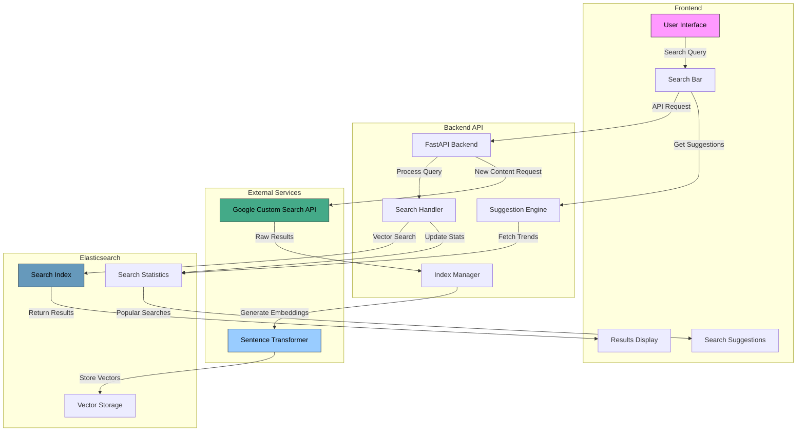
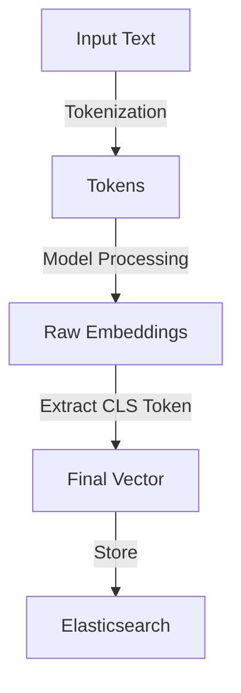

# Indexify

A powerful semantic search engine that combines traditional text search with vector similarity using Elasticsearch and machine learning embeddings.

[Indexify Video](https://github.com/user-attachments/assets/4e4668a6-6904-4ed0-8cc6-4b9a380e94eb)

## Overview

Indexify is a comprehensive search solution that leverages Google Custom Search API, Elasticsearch, and transformer-based embeddings to provide intelligent search capabilities. It combines traditional keyword search with semantic understanding to deliver more relevant results.

## ✨ Features

- 🔍 **Hybrid Search**: Combining text and vector similarity
- 🤖 **ML-Powered**: Text embeddings using sentence-transformers
- 📊 **Analytics**: Search statistics and trending queries tracking
- 💡 **Smart Suggestions**: Based on user behavior
- 🔄 **Auto-Fetch**: Content from Google Custom Search when needed
- 🎯 **Advanced Search**: Multiple criteria (title, author, date, keywords)

## Built with

- [Next.js](https://nextjs.org/)
- [Tailwind CSS](https://tailwindcss.com/)
- [Elastic Search](https://www.elastic.co/)
- [FastAPI](https://fastapi.tiangolo.com/)
- [Google Custom Search](https://developers.google.com/custom-search?hl=es-419)

## 🏗️ Architecture



### Backend Structure

```sh
backend/
├── app/
│   ├── api/routes/
│   │   └── routes.py
│   ├── core/
│   │   ├── models.py
│   │   ├── elasticsearch.py
│   │   ├── suggestion.py
│   │   ├── custom_search.py
│   │   ├── utils.py
│   │   ├── client.py
│   │   ├── index.py
│   │   └── documents.py
│   └── main.py
├── .env
├── requirements.txt
└── README.md
```

### Frontend Structure

```sh
frontend/indexify/
├── .next/
├── node_modules/
├── public/
├── src/
│   └── app/
│       ├── globals.css
│       ├── layout.tsx
│       └── page.tsx
├── components/
├── └── SearchBar.tsx
├── config/
│   └── constants.ts
├── hooks/
│   ├── useSearch.ts
│   └── useSuggestions.ts
├── types/
│   └── index.ts
├── .env
├── .gitignore
├── eslint.config.mjs
├── next-env.d.ts
├── next.config.ts
├── package-lock.json
├── package.json
├── postcss.config.mjs
├── README.md
├── tailwind.config.ts
└── tsconfig.json
```

## Technical Details

### Elasticsearch Index Mapping

The system uses a sophisticated index mapping with the following fields:

```sh
"mappings": {
                "properties": {
                    "title": {
                        "type": "text",
                        "analyzer": "custom_text_analyzer",
                        "fields": {
                            "keyword": {"type": "keyword"},
                            "completion": {
                                "type": "completion",
                                "analyzer": "custom_text_analyzer"
                            }
                        }
                    },
                    "author": {"type": "keyword"},
                    "publication_date": {"type": "date"},
                    "abstract": {"type": "text", "analyzer": "custom_text_analyzer"},
                    "keywords": {
                        "type": "keyword",
                        "fields": {
                            "text": {
                                "type": "text",
                                "analyzer": "custom_text_analyzer"
                            }
                        }
                    },
                    "content": {"type": "text", "analyzer": "custom_text_analyzer"},
                    "vector": {"type": "dense_vector", "dims": vector_dims},
                    "search_count": {"type": "long"}
                }
            }
```

- `title`: Text field with keyword and completion sub-fields
- `author`: Keyword field for exact matching
- `publication_date`: Date field
- `abstract`: Text field with custom analyzer
- `keywords`: Keyword field with text sub-field
- `content`: Text field with custom analyzer
- `vector`: Dense vector field for semantic search
- `search_count`: Long field for tracking popularity

## Embedding Process

Indexify uses the `sentence-transformers/all-MiniLM-L6-v2` model to generate semantic text embeddings that capture the meaning of content. Here's how the process works:

### 1. Model Initialization

```python
model_name = "sentence-transformers/all-MiniLM-L6-v2"
tokenizer = AutoTokenizer.from_pretrained(model_name)
model = AutoModel.from_pretrained(model_name)
```

### 2. Content Processing Flow



### 3. Technical Implementation

#### Text Preprocessing & Embedding Generation

```python
def generate_embedding(text: str) -> list[float]:
    # Tokenize with truncation for long texts
    inputs = tokenizer(
        text,
        return_tensors="pt",
        truncation=True,
        max_length=512
    )

    # Generate embeddings without gradient computation
    with torch.no_grad():
        outputs = model(**inputs)

    # Extract CLS token embedding
    embedding = outputs.last_hidden_state[:, 0, :].squeeze().tolist()
    return embedding
```

#### Search Process with Embeddings

```python
def vector_text_search(client, index_name, query_text, query_vector):
    query = {
        "query": {
            "script_score": {
                "query": {
                    "multi_match": {
                        "query": query_text,
                        "fields": ["title^3", "abstract^2", "content"]
                    }
                },
                "script": {
                    "source": "cosineSimilarity(params.query_vector, 'vector') + 1.0",
                    "params": {"query_vector": query_vector}
                }
            }
        }
    }
```

### 4. Processing Pipeline

1. **Input Processing**:

   - Combines title and snippet for search results
   - Truncates to 512 tokens maximum
   - Handles special tokens automatically

2. **Vector Generation**:

   - Converts tokens to model inputs
   - Processes through transformer model
   - Extracts CLS token representation
   - Converts to float list format

3. **Search Integration**:

   - Stores vectors in Elasticsearch
   - Uses cosine similarity for matching
   - Combines with text-based relevance
   - Boosts results based on field importance

4. **Result Scoring**:
   - Base text similarity score
   - Vector similarity contribution
   - Optional keyword presence boost
   - Field-specific weight multipliers

The embedding system enhances search accuracy by:

- Capturing semantic relationships
- Understanding context beyond keywords
- Enabling similarity-based matching
- Supporting hybrid ranking strategies

## Search Features

1. Vector Text Search

- Combines traditional text matching with vector similarity
- Uses script scoring for hybrid ranking
- Supports fuzzy matching and field boosting

2. Advanced Search

- Multi-criteria search (title, author, date range, keywords)
- Customizable result size
- Sort by relevance and date

3. Search Suggestions

- Based on previous searches and trending queries
- Tracks and updates search statistics
- Provides real-time completion suggestions

## API Routes

Core Endpoints

```sh
POST /api/search
POST /api/advanced-search
GET /api/suggestions
```

## Interested in Contributing?

If you're interested, please see [Backend](https://github.com/DavidReque/Indexify/blob/main/backend/README.md) and [Frontend](https://github.com/DavidReque/Indexify/blob/main/frontend/indexify/README.md) Guidelines.

## License

This project is licensed under the MIT License - see the [LICENCE](LICENCE) file for details.
